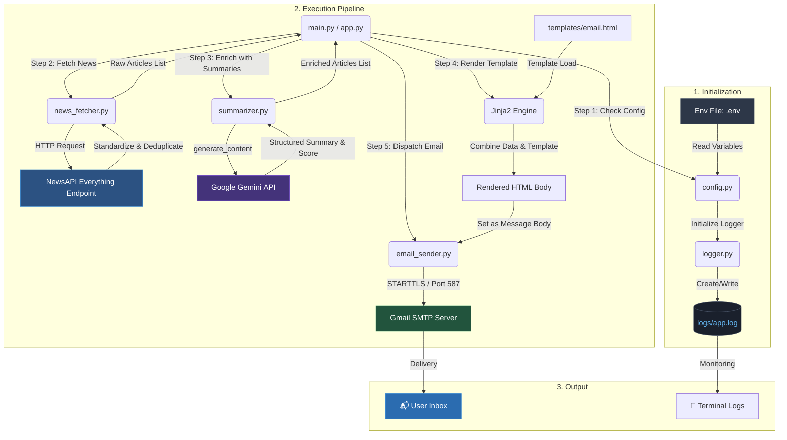

# 📰 AI News Agent

[](https://www.python.org/)
[](https://ai.google.dev/gemini-api/docs)
[](https://opensource.org/licenses/MIT)

An automated Python-based news agent that curates the latest Artificial Intelligence and Technology news, generates structured summaries using Google Gemini, renders a beautiful glassmorphic HTML email, and delivers it to your inbox on a daily schedule.

---

## 🗺️ System Architecture Diagram

Below is the execution flow of the AI News Agent pipeline, highlighting configuration inputs, external APIs, and the background logging system:



---

## 🗂️ Project Structure

```text
api-agent/
├── main.py            # Primary application entry point
├── app.py             # Orchestrates the fetch-summarize-send pipeline
├── config.py          # Central configuration registry and validation
├── news_fetcher.py    # Integrates with NewsAPI, standardizes & deduplicates news
├── summarizer.py      # Connects to Google Gemini API using the new google-genai SDK
├── email_sender.py    # Connects to Gmail SMTP via STARTTLS and dispatches email
├── scheduler.py       # Handles background loops to repeat pipeline daily at 08:00
├── logger.py          # Central log initialization, writing to logs/app.log
├── mock_data.py       # Shared offline mock articles for previewing template design
├── preview_email.py   # Renders templates/email.html locally to email_preview.html
├── run_tests.py       # Interactive diagnostic test suite for individual modules
│
├── templates/
│   └── email.html     # Table-based, mobile-responsive HTML email template
├── logs/
│   └── app.log        # Rolling diagnostic application log file (Auto-generated)
├── requirements.txt   # List of package dependencies
├── .env.example       # Template containing dummy secrets
├── .env               # ⚠️ Real secrets (Ignored by Git, keep secure!)
└── .gitignore         # Configures files ignored by version control
```

---

## 📋 Prerequisites

Before running the project, make sure you have installed:

| Requirement | Recommended Version | Verification Command |
|---|---|---|
| **Python** | `3.10+` | `python --version` |
| **pip** | Latest | `pip --version` |
| **Gmail Account** | — | Required for SMTP dispatch (with 2FA enabled) |
| **NewsAPI Key** | Free tier | Get one at [newsapi.org](https://newsapi.org/register) |
| **Gemini API Key** | Free tier | Get one at [Google AI Studio](https://aistudio.google.com/) |

---

## 🚀 Setup & Installation

Follow these steps to set up the project locally:

### 1. Clone the Repository
```bash
git clone https://github.com/your-username/api-agent.git
cd api-agent
```

### 2. Set Up a Virtual Environment
A virtual environment prevents package conflicts with other projects:
```bash
# Create virtual environment
python -m venv venv

# Activate on Windows (PowerShell)
.\venv\Scripts\Activate.ps1

# Activate on macOS / Linux
source venv/bin/activate
```
*You will see `(venv)` prepended to your command prompt.*

### 3. Install Package Dependencies
```bash
pip install -r requirements.txt
```

### 4. Configure Your Secrets
Copy the template environment file to create your own configuration:
```bash
# Windows Command Prompt / PowerShell
copy .env.example .env

# macOS / Linux
cp .env.example .env
```

Open the newly created `.env` file in your editor and enter your real credentials:
```env
# API KEYS
GEMINI_API_KEY=AIzaSy...yourkeyhere
NEWS_API_KEY=9dbe...yourkeyhere

# EMAIL SETTINGS
EMAIL_ADDRESS=yourgmail@gmail.com
EMAIL_PASSWORD=abcd efgh ijkl mnop      # ⚠️ Must be a Gmail App Password
EMAIL_RECIPIENT=receiver@example.com

# PIPELINE CONFIGURATION
SMTP_SERVER=smtp.gmail.com
SMTP_PORT=587
SEND_TIME=08:00
NEWS_MAX_ARTICLES=15
NEWS_TECH_RATIO=0.80
GEMINI_MODEL=gemini-2.0-flash
```

---

## 🔑 Gmail App Password Setup

For security reasons, Google blocks basic logins via SMTP using your standard account password. To resolve this:
1. Go to your [Google Account Settings](https://myaccount.google.com/).
2. Enable **2-Step Verification** (required to generate app passwords).
3. Search for or navigate to **App Passwords** ([myaccount.google.com/apppasswords](https://myaccount.google.com/apppasswords)).
4. Create a new App Password (select App: `Mail`, Device: `Windows Computer` or `Other`).
5. Copy the 16-character passcode (e.g., `abcd efgh ijkl mnop`) and paste it into `EMAIL_PASSWORD` in your `.env` (without spaces).

---

## 💻 Running the Application

### 🧪 Run the Diagnostic Test Menu
You can verify each system module in complete isolation before starting the pipeline:
```bash
python run_tests.py
```
This launches a terminal menu where you can test **Configuration loading**, **News Fetching**, **Gemini API connection**, **SMTP auth**, and **Scheduler calculations**.

### 🎨 Preview the Email Layout (No API calls)
Generate a local file `email_preview.html` to preview the glassmorphic dark-theme email design:
```bash
python preview_email.py
```
Double-click `email_preview.html` or drag it into Chrome/Edge to review the visual aesthetics.

### ⚡ Run the Pipeline Manually
Run the full flow immediately (fetch news → summarize → render email → send digest):
```bash
python main.py
```

### ⏰ Run the Scheduler (Active Timer Loop)
Start the scheduler loop which sleeps and runs automatically at `SEND_TIME`:
```bash
python scheduler.py
```
*To run the pipeline immediately upon launching the scheduler, use the `--now` flag:*
```bash
python scheduler.py --now
```

---

## ⏰ Automated Scheduling on Windows

Keeping a terminal window running `scheduler.py` 24/7 is not ideal for desktop machines. Instead, use **Windows Task Scheduler** to execute `main.py` directly:

1. Open **Task Scheduler** (search in Start menu).
2. Click **Create Basic Task** in the Actions panel.
3. Set Name to `AI News Agent` and Trigger to `Daily` at `08:00 AM`.
4. Choose **Start a program** as the action.
5. In **Program/script**, select your virtual environment python executable:
   `C:\IT\Projects\api-agent\venv\Scripts\python.exe`
6. In **Add arguments (optional)**, type `main.py`.
7. In **Start in (optional)**, type the absolute path of your workspace:
   `C:\IT\Projects\api-agent`
8. Click **Finish**. The task will run daily, even if you are not logged in.

---

## 🐛 Troubleshooting & Diagnostic Logs

Check **`logs/app.log`** for historical traces. It records timestamped operational details at the `INFO`, `WARNING`, `ERROR`, and `CRITICAL` levels.

### Common Issues
* **IndentationError on Startup**: Make sure you haven't introduced misplaced tab characters or unmatched quotes in `.env` variables or Python code.
* **429 RESOURCE_EXHAUSTED (Gemini)**: Free tier limits are capped at ~15 requests/minute. If you exhaust your daily limit, the pipeline falls back to using original article descriptions. Wait until midnight PT for quota resets.
* **535 Authentication Failed (SMTP)**: Gmail rejected login. Verify your `EMAIL_ADDRESS` matches the account that generated the `EMAIL_PASSWORD` (App Password). Make sure your App Password is 16 letters, has no spaces, and that 2-Factor Authentication is active.
* **Connection Timeout (SMTP)**: Port `587` might be blocked on public/corporate networks. Test on a standard network or home router.

---

## 🚀 Future Improvements

* **Database History**: Maintain a SQLite database file to track previously sent articles and prevent duplicates from being emailed in subsequent digests.
* **Multi-Recipient Support**: Allow sending emails to a subscriber list rather than a single recipient.
* **Sentiment Analysis Filter**: Filter out overly negative or sensationalist news, keeping the digest strictly educational.
* **Interactive Web Dashboard**: Build a lightweight Flask or FastAPI dashboard to view today's articles, check system logs, and trigger manual pipeline runs through a clean UI.

---

*Designed and implemented with python, jinja2, and Google Gemini AI*
